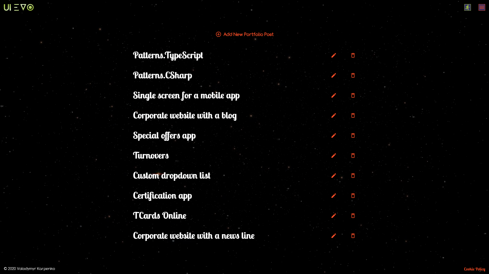

# uievo.com
A real-world cross-platform single-page application that is built using C# programming language, ASP.NET Core framework (API), 
and MySQL database for server-side logic as well as TypeScript programming language, React and Redux libraries, 
React Bootstrap framework for client-side logic. This is my personal portfolio website.

## Prerequisites 
In order to run the application, you need the following software to be up and running on your computer (both PC and MAC are eligible)
1. Visual Studio
2. XAMPP

#### Adjust "ConnectionStrings" and "AdminSettings" in the appsettings.json file as appropriate.

